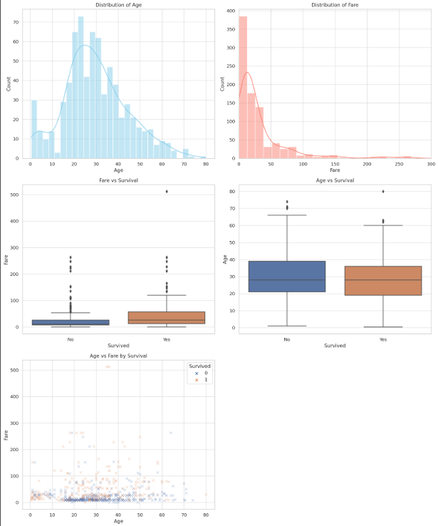

# 🧪 Task 5: Exploratory Data Analysis (EDA) – Titanic Dataset

## 📌 Objective
To explore the Titanic dataset and extract meaningful insights using visual and statistical tools. The goal is to understand patterns, trends, and factors that influenced passenger survival.

---

## 🛠️ Tools Used
- Python
- Jupyter Notebook
- Pandas
- Matplotlib
- Seaborn

---

## 🖼️ Sample Visual Preview

---

## ✅ Tasks Completed

### a. Descriptive Statistics
- Used `.describe()`, `.info()`, and `.value_counts()` to get a basic understanding of the dataset.
- Checked data types, missing values, and unique categories.

### b. Visual Analysis – Pairplot & Heatmap
- `sns.pairplot()` used to observe relationships among numeric variables by survival status.
- `sns.heatmap()` used to show correlation between variables.

### c. Relationship & Trend Identification
- Analyzed plots to detect trends:
  - Survival is strongly related to **gender**, **ticket class**, and **fare**.
  - Weak to moderate relationship with **age** and **family size**.

### d. Plotted Key Charts
- **Histograms**: Age, Fare
- **Boxplots**: Age vs Survived, Fare vs Survived
- **Scatterplot**: Age vs Fare (colored by survival)

### e. Observations Written for Each Visual
- Each plot is followed by clear, simple observations explaining what the data shows and why it matters.

### f. Summary of Findings
- Clear summary in plain English highlighting the most important patterns:
  - Women, children, and 1st class passengers had the highest survival rates.
  - High fare passengers tended to survive more.
  - Passengers with small families onboard had better chances of survival.

---

## 👀 Sample Visuals Included
- Pairplot (Age, Fare, Pclass by Survival)
- Heatmap of correlations
- Histograms and boxplots
- Scatterplot with hue for survival

---

